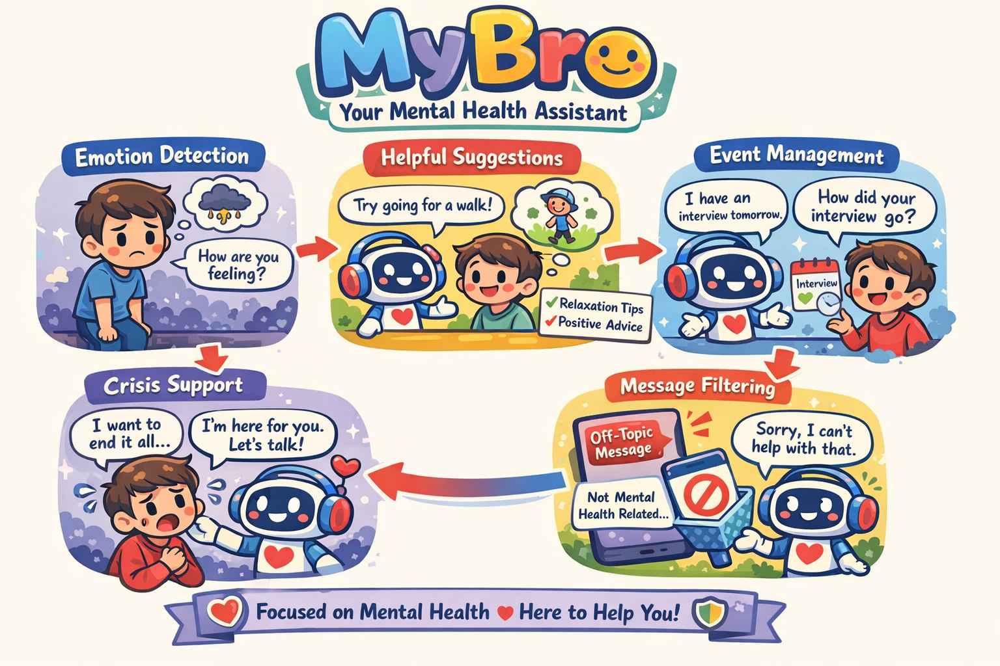

# MyBro - An AI To Help You Get Rid Of Depression

*"Sometimes you need someone who fights for you when you can't fight for yourself."*



A compassionate AI chatbot designed to provide mental health support with genuine human-like responses. Built with Python, LangChain, and Google's Gemini API.

## 🎯 **What Makes MyBro Different?**

Unlike clinical chatbots that just ask questions, MyBro responds like a **caring older brother** who:
- **Fights for you** when you're feeling down
- **Challenges negative thoughts** with passion and protection
- **Gives you reasons to live** instead of just listening passively
- **Shows real emotion** and urgency about your wellbeing
- **Protects you from your own dark thoughts**

## 🎯 **Our Second Repo For anroid code**

*Link: https://github.com/ArchitAnant/Sorea.git*

## 🚀 **Installation & Setup**

### **1. Clone the Repository**
```bash
git clone https://github.com/Jit-Roy/MyBro.git
cd MyBro
```

### **2. Install Dependencies**
```bash
pip install -r requirements.txt
```

### **3. Configure Environment**
```bash
cp .env.example .env
```

Edit `.env` and add your Gemini API key:
```
GEMINI_API_KEY=your_actual_gemini_api_key_here
```

### **4. Get Gemini API Key**
- Visit [Google AI Studio](https://makersuite.google.com/app/apikey)
- Create a new API key
- Copy it to your `.env` file

### **5. Run MyBro**
```bash
python main.py
```

## ⚠️ **Important Disclaimers**

- **Not a Replacement for Professional Care**: MyBro provides peer support, not medical treatment
- **Privacy**: Conversations are stored locally; review data handling before deployment

## 📜 **License**

This project is open source and available under the [MIT License](LICENSE).